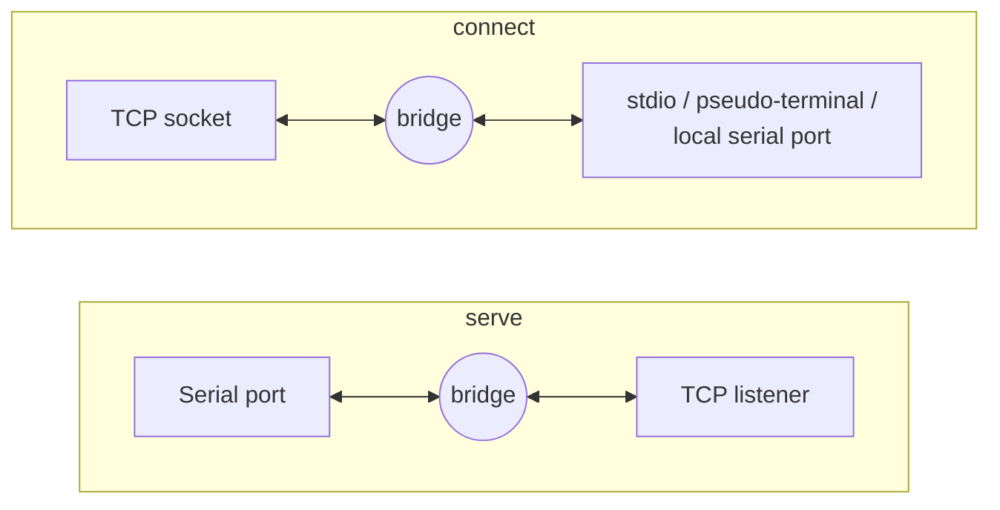

# serial-tcp

Share a serial port over TCP. One tool, same commands, on macOS, Windows and
Linux — so a physical device plugged into one machine can be read from
another.

## TL;DR

**On the machine with the hardware:**

```sh
serial-tcp dashboard --bind 0.0.0.0:4000
```

Copy the token printed in the console and open it from another device, e.g.
`http://<server-ip>:4000/?token=...`. Or skip the token and restrict by
network instead:

```sh
serial-tcp dashboard --bind 0.0.0.0:4000 --no-token --allow 192.168.1.0/22
```

In the dashboard, pair each detected device onto a port (4001, 4002, …) —
that's what decides which UART is reachable on which port.

**On every other machine:**

```sh
serial-tcp connect --to <server-ip>:4001 --pty --protocol rfc2217 --baud 460800
```

- `--pty` exposes a virtual serial port other software can open directly; use
  `--stdio` instead to see the raw bytes in the terminal.
- `--protocol rfc2217` lets the client change the server's baud rate (and
  other line settings) mid-session; use `raw` for a plain byte pipe that
  leaves the server's settings alone.

Details: [The dashboard](#the-dashboard), [Who can get in](#who-can-get-in),
[Carrying line settings and control signals](#carrying-line-settings-and-control-signals).

## How it works

The whole tool is one primitive — pump bytes between two endpoints — wired up
two ways:



`dashboard` runs many `serve`s at once, driven from a browser.

`serve` runs on the machine with the physical device. `connect` runs on every
other machine that wants to use it. That symmetry is why Windows needs no
special case anywhere in the code: one half of a com0com pair is just a serial
port like any other, so it goes through the exact same `--port` path as real
hardware.

`dashboard` is the same thing again, several at a time: a web UI on port 4000
that supervises ports on 4001, 4002, 4003, … Each one behaves exactly like a
`serve`, so every client above still works against it unchanged.

## Download

Prebuilt binaries for Windows, macOS and Linux are attached to each
[release](../../releases). One file, no installer, no runtime — unpack it and
run it.

macOS builds are unsigned, so Gatekeeper blocks them the first time. Clear the
quarantine flag once and it will run from then on:

```sh
xattr -d com.apple.quarantine ./serial-tcp
```

## Build

Natively, on whichever OS you're building for:

```sh
cargo build --release
```

The binary lands at `target/release/serial-tcp` (`serial-tcp.exe` on Windows).
It has no runtime dependencies beyond what the OS already provides.

### Cross-compiling a Windows .exe from macOS or Linux

Native Rust cross-compilation only produces a linkable binary for Windows if a
Windows linker and the Windows SDK/CRT are available, which macOS and Linux
don't have out of the box. [`cargo-xwin`](https://github.com/rust-cross/cargo-xwin)
supplies both — it downloads a copy of the SDK/CRT on first use and links
against that.

```sh
rustup target add x86_64-pc-windows-msvc
cargo install cargo-xwin
cargo xwin build --release --target x86_64-pc-windows-msvc
```

Output: `target/x86_64-pc-windows-msvc/release/serial-tcp.exe`. Copy that one
file to the Windows machine — nothing else needs to be installed there, not
even Rust. The first build downloads the SDK (a few hundred MB); later builds
reuse the cached copy.

`cargo check --target x86_64-pc-windows-msvc` (no `xwin`) is enough to
type-check Windows-specific code paths without linking, and needs nothing extra
installed.

### Linux static builds

Port enumeration on Linux uses libudev, a C library needed at link time. Drop
it for a static musl binary:

```sh
cargo build --release --no-default-features --target x86_64-unknown-linux-musl
```

`serve` and `connect` are unaffected; only `list` stops finding ports.

## Quick start — no hardware needed

`--fake` creates a pseudo-terminal and serves that instead of a real device,
so you can exercise the whole path with nothing plugged in. Three terminals:

```sh
# terminal 1
serial-tcp serve --fake
# -> fake device ready at /dev/ttys001

# terminal 2
serial-tcp connect --to 127.0.0.1:4000 --stdio

# terminal 3 — stands in for the hardware
cat /dev/ttys001                    # see what terminal 2 sends
printf 'hello\n' > /dev/ttys001     # send something to terminal 2
```

Text typed in terminal 2 shows up in terminal 3's `cat`, and vice versa. The
test suite uses the same trick, so `cargo test` needs no hardware either.

## Using a real device

Find it, then share it:

```sh
serial-tcp list
serial-tcp serve --port /dev/cu.usbserial-1410 --baud 115200
```

On macOS, use the `cu.*` node, not `tty.*` — `list` hides the `tty.*` twin of
each device by default (`--all` shows both), because opening `tty.*` blocks
waiting for carrier detect.

This listens on `127.0.0.1:4000` only. From another program on the *same*
machine:

```sh
serial-tcp connect --to 127.0.0.1:4000 --stdio
```

## Reading a device across machines

This is the common case: the hardware is plugged into one computer, and you
want to read it from another. It works the same way regardless of which OS is
on which side — including Windows on one end and macOS or Linux on the other.

**On the machine with the hardware** (say it's Windows, device `COM3`):

```
serial-tcp.exe serve --port COM3 --baud 115200 --bind 0.0.0.0:4000
```

`--bind 0.0.0.0:4000` is required to accept connections from other machines —
the default `127.0.0.1` deliberately only accepts local ones. Allow inbound
TCP port 4000 through the Windows Firewall, then find this machine's LAN
address with `ipconfig`.

**On the reading machine** (say it's macOS):

```sh
serial-tcp connect --to 192.168.1.10:4000 --stdio
```

Swap `serve`/`connect` and the platform-specific pieces (`--port COM3` vs.
`--port /dev/cu.usbserial-1410`, `.exe` vs. no extension) and the same two
commands work for any direction: Windows↔macOS, Linux↔Windows, macOS↔Linux, or
any OS talking to itself.

⚠️ The link is **unauthenticated and unencrypted**. Anyone who can reach that
TCP port controls the device. If the network between the two machines isn't
trusted, don't expose it directly — tunnel over SSH instead and connect to
`127.0.0.1` on both ends:

```sh
ssh -L 4000:127.0.0.1:4000 user@windows-machine
serial-tcp connect --to 127.0.0.1:4000 --stdio
```

## Giving another program a real serial port

`--stdio` is fine for looking at raw bytes yourself, but some software will
only talk to a device node, not a socket or your terminal.

**macOS and Linux** — a pseudo-terminal is enough, no driver needed:

```sh
serial-tcp connect --to 192.168.1.10:4000 --pty
# virtual serial port ready at /dev/ttys004
```

Point the application at the printed path; it behaves like a local serial
port.

**Windows** has no pseudo-terminals, and a virtual COM port cannot be created
from user space at all — it needs a kernel driver. Use
[com0com](https://com0com.com/), which is open source and now ships a signed
build for Windows 10/11 (no test-signing mode required):

1. Install com0com and create a pair, for example `COM10` <-> `COM11`.
2. Run `serial-tcp connect --to 192.168.1.10:4000 --port COM10`.
3. Point your application at `COM11`.

If installing a driver is not acceptable in your environment, the way out is
to make the client application speak TCP (or RFC 2217, below) directly
instead of expecting a device node.

## The dashboard

One device and one flag soup is fine. Several devices, or a baud rate you keep
changing, or a machine you have to walk over to — that is what the dashboard is
for.

```sh
serial-tcp dashboard
# dashboard listening on http://127.0.0.1:4000
# open  http://127.0.0.1:4000/?token=789dfa82…
# config  serial-tcp.json
```

Open the printed URL. The token in it is what gets you in; the page stores it in
a cookie and you will not need it again on that browser. From there you can
pair any detected device onto a TCP port, start and stop each one, change line
settings, watch the bytes arrive, and type bytes back to the device.

Everything is remembered in `serial-tcp.json` next to wherever you ran it
(`--config` puts it elsewhere). Ports marked *start automatically* come back up
on their own after a restart.

The baud field offers the usual rates from 300 up to 1000000, and still accepts
anything you type that is not on the list.

To reach it from another machine, bind it to the network and open the port in
your firewall:

```sh
serial-tcp dashboard --bind 0.0.0.0:4000
```

Startup prints the address other machines should use, so there is no need to go
hunting through `ipconfig` for it.

### Who can get in

There are two independent gates, and they cover different things.

**The token** guards configuration: pairing devices, changing settings, sending
bytes from the send box. It is on by default. `--no-token` turns it off, which
is reasonable on a network you control and a bad idea on one you do not:

```sh
serial-tcp dashboard --no-token
```

**The allowlist** guards by address, and it is the only control the data ports
can have at all. Ports 4001 and up are ordinary raw or RFC 2217 endpoints, and
they cannot be asked for a password without breaking every client that needs to
reach them — pyserial, ser2net, u-center and this tool's own `connect` know
nothing about our token. Where a connection *comes from* is all that is left to
judge it by:

```sh
serial-tcp dashboard --bind 0.0.0.0:4000 --allow 192.168.8.0/22
```

That applies to the dashboard **and** to every serial port it serves. Repeat
`--allow` for more than one range; a bare address like `--allow 192.168.9.50` is
a range of one. Loopback is always allowed, so a rule naming some other network
can never lock you out of your own machine.

The two combine the way you would want. Token only, on a trusted LAN. Allowlist
only, when the clients are scripts that cannot hold a token. Both, when the
dashboard is reachable somewhere you would rather it were not. Neither, and the
tool says so at startup and badges it in the UI:

```
access  NO TOKEN, from anywhere

WARNING: this dashboard is on the network with no token and no address restriction.
         Anyone who can reach it can reconfigure every device attached to it.
         Consider --allow 192.168.9.0/24
```

Whatever the settings, a paired port still listens on `127.0.0.1` until you tick
*reachable from the network*. If the network in between is not trusted, leave it
that way and tunnel instead:

```sh
ssh -L 4001:127.0.0.1:4001 user@the-machine
```

None of this is encryption. An allowlist stops the wrong hosts connecting; it
does nothing about anyone reading the traffic in between.

### Live monitor

The monitor shows traffic whether or not a TCP client is connected — the point
is usually to see whether a device is saying anything at all. It reads the line
only while somebody is actually watching, so a port nobody has open still hands
its first bytes to the next client rather than swallowing them.

A browser that cannot keep up drops frames rather than slowing the wire down,
and says so. Serial timing matters more than a complete picture in a log pane.

### Changing settings restarts the port

Line settings are fixed when a device is opened and this tool never mutates them
afterwards, so saving new ones stops and reopens the port. Any client connected
at that moment is disconnected. The UI says so before you save.

RFC 2217 is the exception, and the reason it exists: a client on an RFC 2217
port can change baud rate and control lines mid-session, without restarting
anything. Note that it *will* — a client connecting with its own `--baud` pushes
that to the device, so the dashboard's setting is the starting point rather than
the last word.

## Carrying line settings and control signals

The default `raw` protocol moves bytes and nothing else: `--baud`, `--parity`
and friends apply only to the port each process opens locally, so a client
cannot change the far end's baud rate and no modem control lines are conveyed.

`--protocol rfc2217` adds the [Telnet Com Port Control
Option](https://www.rfc-editor.org/rfc/rfc2217.html) on top of the byte
stream, which carries baud rate, character format, flow control, break, and
the DTR/RTS/CTS/DSR/CD/RI signals — and lets the client change them
mid-session.

```sh
serial-tcp serve --port /dev/cu.usbserial-1410 --protocol rfc2217
serial-tcp connect --to 192.168.1.10:4000 --protocol rfc2217 --pty
```

Both ends must agree; a raw client talking to an RFC 2217 server will see
Telnet control bytes as data.

The real payoff is that RFC 2217 is what everyone else already speaks, so no
client of ours is needed at all:

```python
import serial
port = serial.serial_for_url("rfc2217://192.168.1.10:4000", baudrate=115200)
```

pyserial is an independent implementation, which makes it a genuine
conformance check rather than a test of our own assumptions —
`tests/rfc2217.rs` covers the same ground in-process so `cargo test` catches
regressions without needing Python. The same server should work with
`ser2net` clients and commercial device servers.

### A note on `--fake` and line settings

A pseudo-terminal has no baud rate, so `tcsetattr` rejects the change and the
port keeps reporting whatever it started with. Reporting that back would be
reporting a fiction, and a conforming client treats the mismatch as a
rejection and refuses to open. With `--fake` there is no real line to
describe, so the server records what was asked for and reports that instead.
Real ports never take this path: there the server always reports what the
hardware actually did, so a rate the device cannot do is visible as such
rather than silently accepted.

## CLI reference

Every command also takes `--help` for the full, current list of flags.

```
serial-tcp list [--all]
serial-tcp serve (--port <PORT> | --fake) [--bind <ADDR>] [--protocol raw|rfc2217]
                  [--baud <N>] [--data-bits 5|6|7|8] [--parity none|odd|even]
                  [--stop-bits 1|2] [--flow-control none|software|hardware]
serial-tcp connect --to <ADDR> (--stdio | --pty | --port <PORT>) [--protocol raw|rfc2217]
                    [--baud <N>] [--data-bits 5|6|7|8] [--parity none|odd|even]
                    [--stop-bits 1|2] [--flow-control none|software|hardware]
serial-tcp dashboard [--bind <ADDR>] [--token <TOKEN> | --no-token]
                      [--allow <CIDR>]... [--config <PATH>]
                      [--base-port <PORT>] [--assets-dir <DIR>]
```

`dashboard` defaults to `127.0.0.1:4000`, a config at `./serial-tcp.json`, and
`4001` as the first port handed out. `--token` (or `SERIAL_TCP_TOKEN`) sets the
token and saves it; without one, a random token is generated on first run.
`--no-token` and `--allow` are described under [Who can get in](#who-can-get-in)
and are both remembered in the config, so later runs need not repeat them.
`--base-port` only seeds a new config — after that the file is what counts.
`--assets-dir` serves the dashboard page from disk instead of the copy compiled
into the binary, which is only useful when working on the UI itself.

`-v` / `--verbose` (before the subcommand) turns on debug logging on the
console — useful for seeing how many bytes moved in each direction and why a
session ended.

Regardless of `--verbose`, every run also writes the full debug-level trace to
a log file — `./serial-tcp.log` by default, `--log-file <PATH>` to change
where, `--no-log-file` to turn it off. That way a session that looked clean on
screen can still be diagnosed after the fact, without having to reproduce it
with `--verbose` in hand.

## Notes on behaviour

- `TCP_NODELAY` is set. Nagle's algorithm would coalesce small writes and
  smear the inter-frame gaps that protocols like Modbus RTU depend on.
- Bytes are forwarded as soon as they arrive rather than batched into full
  buffers, for the same reason.
- Only one client is bridged at a time, per port. Two writers on one serial line
  interleave into garbage.
- Data the device sent while no client was connected is discarded when a
  client arrives, rather than delivered as a corrupt partial frame.
- The dashboard's send box shares one handle with the bridge, so bytes typed
  there can never land in the middle of a client's frame.

## Testing

```sh
cargo test
```

None of it needs real hardware. The `serve`/`connect` tests use
pseudo-terminals, the same trick `--fake` uses, so they are Unix-only. The
dashboard's tests stand an in-memory `SerialPort` implementation in for the
device instead, which means they — and therefore most of the suite — run on
Windows too.

## Not implemented yet

- Nothing is encrypted. `--allow` restricts who may connect, but anyone who can
  read the traffic in between still can. Tunnel over SSH where that matters.
- The data ports carry no authentication of their own — by necessity, since the
  clients that need them cannot hold a token. `--allow` is the control they have.
- UART line status (parity/framing/overrun errors, break detection) is not
  reported to RFC 2217 clients; `SET-LINESTATE-MASK` is accepted but nothing
  is ever notified.
- Mark and space parity, and 1.5 stop bits, exist in RFC 2217 but not in the
  underlying crate's API, so they are declined rather than applied.
- The client does not reconnect if the link drops.
